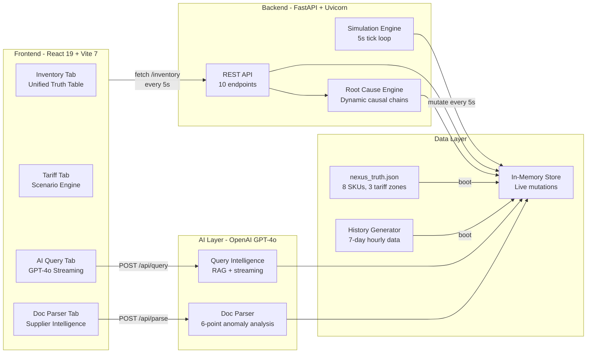
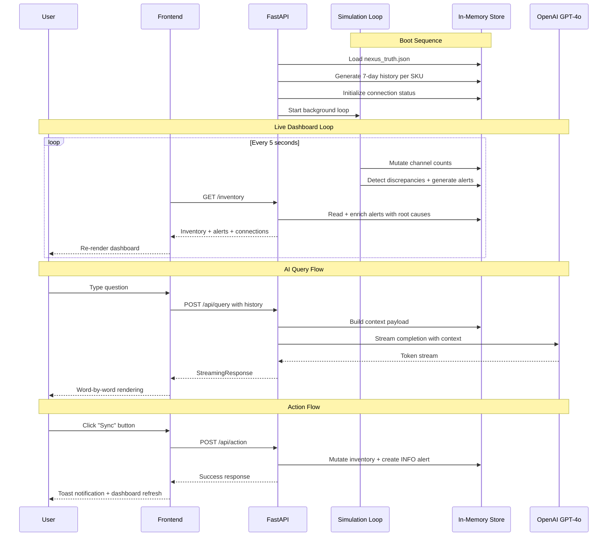

# NexusLink — Supply Chain Data Fabric & Intelligence Engine

[](https://www.python.org/downloads/)
[](https://react.dev/)
[](https://fastapi.tiangolo.com/)
[](https://opensource.org/licenses/MIT)

**Unify inventory across every sales channel, detect discrepancies in real time, and act on AI-powered intelligence — before revenue is lost.**

## Quick Highlights

- **Unified Inventory Truth**: Reconcile Shopify, Amazon, WMS, POS, and ShipBob counts into a single source of truth
- **Live Simulation Engine**: Background tick every 5 seconds mutates inventory, generates alerts, and simulates channel drift
- **Causal Chain Visualizer**: One-click "Why?" reveals Root Cause -> Effect -> Impact -> Action for every anomaly
- **Tariff Scenario Engine**: Compare "Do Nothing" vs "Shift to Mexico" vs "Split Sourcing" with dynamic financial projections
- **AI Query Console**: Conversational GPT-4o interface with streaming responses and full supply chain context
- **Smart Doc Parser**: Paste a supplier email — AI extracts structured data and cross-references against live inventory, tariffs, and alerts
- **Action Recommendation Engine**: Ranked top-3 next actions with impact, urgency, and confidence scoring
- **Stockout Forecasting**: Per-SKU 7-day/14-day stockout probability and days-of-cover estimates
- **Supplier Risk Scoring**: Parser output is converted into supplier-level risk scores with trend tracking
- **Deterministic Demo Mode**: Pause simulation drift for stable recordings and judging walkthroughs
- **Real-Time Health Score**: Composite 0-100 score tracking inventory sync, risk exposure, returns flow, and alert health

## High-Level Architecture



## The Problem

Multi-channel retailers face a $1.75 trillion global inventory distortion problem:

- **Shopify says 342 units. Amazon says 210. WMS says 289.** Which number is real?
- Overselling 53 units at $28.40 each = **$1,505 in backorder costs** before anyone notices
- A Vietnam tariff hike from 15% to 32% hits in 87 days — affecting 4 SKUs worth **$2.75M in exposure**
- Returns sit uninspected at ShipBob for 24 days, freezing **$40,800 in sellable inventory**
- Supplier emails contain critical PO changes buried in prose — cost increases, ship date delays, capacity warnings

No tool connects these signals into a single pane of glass with actionable intelligence.

## The Solution

NexusLink is a **real-time supply chain data fabric** that:

1. **Ingests** inventory positions from 5 channels (Shopify, Amazon, WMS, ShipBob, POS) into a unified truth layer
2. **Detects** discrepancies, oversells, reorder risks, and demand spikes as they happen
3. **Explains** every anomaly with a dynamic causal chain (Root Cause -> Effect -> Impact -> Action)
4. **Simulates** tariff scenarios to quantify financial exposure and compare mitigation strategies
5. **Parses** supplier documents with AI, cross-referencing against live inventory and tariff data
6. **Acts** on intelligence — sync inventory, release returns, pause channels — with one click

## User Flow

| Step | Screen | What Happens |
|------|--------|-------------|
| **1** | Inventory Tab | See all 8 SKUs across 4 channels, filter by risk, click "Why?" for causal analysis |
| **2** | Tariff Tab | Compare 3 mitigation strategies, see net savings vs remaining cost in real time |
| **3** | AI Query Tab | Ask natural language questions — AI streams answers with live data context |
| **4** | Doc Parser Tab | Paste supplier email — AI extracts fields + generates 4-6 cross-referenced anomalies |

## Features

### Inventory Intelligence
- **Unified truth table**: 8 SKUs across Shopify, Amazon, WMS, and POS with live 5-second updates
- **Channel discrepancy detection**: Red-highlighted mismatches with per-unit risk calculation
- **Stockout model overlay**: 7d/14d risk scores plus estimated days-to-stockout per SKU
- **Velocity sparklines**: 7-day demand trend bars per SKU with up/down indicators
- **Search, filter, sort**: Full-text search, status filters (critical/warning/ok), sort by risk/name/ATP
- **Inline causal chains**: Click "Why?" on any discrepant row to see the full Root Cause -> Action flow
- **SKU detail modal**: Click any row for deep-dive — channel breakdown, enlarged sparkline, recent alerts, action buttons
- **One-click sync**: Reconcile all channels to WMS truth for any SKU

### Anomaly Pulse Map
- SVG network visualization of all 5 channel nodes
- Pulsing red nodes and edges highlight active discrepancies
- Real-time connection status bar with latency and last-sync timestamps

### Causal Chain Visualizer
- Dynamic 4-step flow: Root Cause -> Effect -> Impact -> Action
- Uses live data — actual unit counts, dollar amounts, channel names, lead times
- Covers 5 alert types: oversold/gap, tariff, demand spike, returns backlog, reorder point
- Integrated in inventory rows, SKU modals, and tariff scenarios

### Tariff Scenario Engine
- **3 interactive strategies**: "Do Nothing" (red), "Shift to Mexico" (green), "Split Sourcing" (blue)
- **Dynamic stat cards**: Annual Impact, Net Savings, or Remaining Cost — updates on strategy click
- **Landed cost comparison**: Bar chart highlighting the selected strategy
- **Landed cost table**: Per-country breakdown with current rate, proposed rate, and per-unit costs
- **Causal chain**: Adapts narrative to reflect the chosen strategy

### AI Query Console
- **GPT-4o with streaming**: Word-by-word response rendering
- **Full conversation memory**: Multi-turn context preserved across messages
- **Live data injection**: Every query includes current inventory, tariffs, returns, and recent alerts
- **Action recommendations**: AI suggests actionable commands (sync_inventory, release_returns, pause_channel)
- **Suggested prompts**: One-click starter questions for common analyses

### Recommendation Engine
- **Top-3 ranked next moves**: Returns the highest-impact actions from live discrepancies, stockout risk, returns backlog, and tariff shifts
- **Scoring dimensions**: `expected_impact`, `urgency`, `confidence`, and aggregate `score`
- **One-click execution**: Actionable recommendations expose executable commands in the UI

### Smart Doc Parser
- **Editable textarea**: Pre-filled with sample supplier email, accepts any document
- **GPT-4o extraction**: Extracts PO number, supplier, contact, style, quantity, unit cost, ship date, origin, HTS code, factory load
- **6-point anomaly analysis**: Cost delta, lead time risk, tariff exposure, capacity risk, inventory cross-check, supplier concentration
- **Severity-tagged findings**: Each anomaly has severity (critical/warning/info), title, detail, financial impact, and actionable recommendation
- **Cross-referenced intelligence**: Anomalies are checked against live inventory positions, upcoming tariff scenarios, and recent alerts
- **Supplier risk profiling**: Parsed outputs are converted into a supplier risk score with component breakdown and trend

### System Health & UX
- **Health score ring**: Composite 0-100 score in the header (inventory sync + risk exposure + returns flow + alert health)
- **Connection status bar**: Live latency and sync status for Shopify, Amazon, WMS, ShipBob, POS
- **Toast notifications**: Contextual feedback for every action
- **Keyboard shortcuts**: 1-4 for tabs, / for search, Esc to close modals
- **Collapsible sidebar**: Alert feed with severity badges, timestamps, and action buttons
- **Responsive design**: Mobile-aware sidebar toggling

## Technical Deep Dive

### Simulation Engine (`backend/main.py`)

The background simulation loop runs every 5 seconds and performs:

| Operation | Details |
|-----------|---------|
| **Channel drift** | Random walk on Shopify, Amazon, POS counts (delta: -3 to +2 per tick) |
| **WMS stability** | Slower mutations (15% chance per tick), occasional restocks |
| **Discrepancy detection** | Gap > 5 units triggers discrepancy flag + risk calculation |
| **Risk calculation** | `gap * unit_cost * 12` = annualized capital at risk |
| **Alert generation** | Deduplication check + probability gates (3% reorder, 4% gap) |
| **Connection simulation** | Latency jitter + occasional status degradation |

### Dynamic Root Cause Engine

Every alert is enriched with a context-aware causal chain using live data:

| Alert Type | Data Used | Example Output |
|------------|-----------|----------------|
| **Oversold/Gap** | Channel counts, WMS truth, gap size | "Shopify webhook delay — Alpine Ridge Jacket listed at 342 vs WMS truth of 289" |
| **Tariff** | Country rates, effective dates, SKU count | "Vietnam tariff increase — 15% to 32% effective 2026-05-01" |
| **Demand Spike** | ATP, available units, lead time | "Viral social media exposure — 102 units available, ~10 days of stock remaining" |
| **Returns Backlog** | Limbo count, frozen value, avg days | "ShipBob inspection bottleneck — 3 return batches stuck avg 24 days" |
| **Reorder Point** | Available vs threshold, unit cost | "Sustained demand — 22 available vs 30 safety threshold" |

### Health Score Calculation

| Component | Weight | Scoring |
|-----------|--------|---------|
| **Inventory Sync** | 25 pts | -5 per discrepancy |
| **Risk Exposure** | 25 pts | Scaled by total risk value / $5,000 |
| **Returns Flow** | 25 pts | Penalizes stuck days + frozen value |
| **Alert Health** | 25 pts | -5 per CRITICAL, -2 per WARNING |

### AI Integration

| Feature | Model | Temperature | Max Tokens | Context |
|---------|-------|-------------|------------|---------|
| **Query Console** | GPT-4o | 0.3 | 1,024 | Full inventory + tariffs + returns + recent alerts |
| **Doc Parser** | GPT-4o | 0.1 | 2,048 | Full inventory + tariff scenarios + recent alerts |

### Data Pipeline



## Tech Stack

| Layer | Technology | Purpose |
|-------|-----------|---------|
| **Frontend** | React 19 + Vite 7 | Single-page dashboard with 4 tab views |
| **Charts** | Recharts 3 | Area charts, bar charts for inventory and tariff visualization |
| **Visualization** | SVG + CSS | Pulse map, health ring, sparklines, causal chain flow |
| **Backend** | FastAPI + Uvicorn | Async REST API with background simulation loop |
| **AI** | OpenAI GPT-4o | Streaming query intelligence + structured document parsing |
| **Data** | In-memory Python store | Seed from JSON, mutated by simulation engine |
| **Package Mgmt** | uv (backend) + npm (frontend) | Fast, reliable dependency management |

## Quick Start

### Prerequisites

- Python 3.13+ with [uv](https://docs.astral.sh/uv/)
- Node.js 20+
- OpenAI API key (optional — dashboard works without it; AI Query and Doc Parser require it)

### Step 1: Clone and Setup

```bash
git clone https://github.com/your-repo/nexuslink.git
cd nexuslink
```

### Step 2: Install Dependencies

```bash
# Backend
cd backend
uv sync

# Frontend
cd ../frontend
npm install
```

### Step 3: Configure Environment

```bash
# Optional: Add OpenAI key for AI-powered features
echo "OPENAI_API_KEY=your_key_here" > backend/.env
```

### Step 4: Start Servers

```bash
# Terminal 1 — Backend
cd backend
uv run uvicorn main:app --reload --port 8000

# Terminal 2 — Frontend
cd frontend
npm run dev
```

### Step 5: Open the App

| Service | URL |
|---------|-----|
| **App** | http://localhost:5173 |
| **API** | http://localhost:8000 |
| **API Docs** | http://localhost:8000/docs |

## Demo Walkthrough

1. **Inventory Tab** — Observe live channel counts updating every 5s. Filter to "critical" to see high-risk discrepancies. Click "Why?" on Alpine Ridge Jacket to see the causal chain. Click "Sync" to reconcile.
2. **Tariff Tab** — Click "Shift to Mexico" strategy card. Watch the stat cards update from "Annual Impact: $35K" to "Net Savings: $26K". Review the landed cost comparison chart.
3. **AI Query Tab** — Ask "Which SKUs are at risk of stockout?" or "What's our total tariff exposure from Vietnam?" Watch GPT-4o stream a data-rich answer with action recommendations.
4. **Doc Parser Tab** — Click "Parse with NexusLink AI". Review the 6 structured anomaly findings with severity badges, financial impact, and recommendations. Edit the email and re-parse.

## API Endpoints

| Method | Endpoint | Description |
|--------|----------|-------------|
| `GET` | `/` | Health check — API status |
| `GET` | `/inventory` | Full inventory + enriched alerts + recommendations + supplier risk summary |
| `GET` | `/api/history` | 7-day hourly historical data per SKU |
| `GET` | `/api/health` | Composite health score with breakdown |
| `GET` | `/api/recommendations` | Ranked action recommendations from live state |
| `GET` | `/api/supplier-risks` | Supplier risk leaderboard from parsed documents |
| `POST` | `/api/query` | AI query with streaming response |
| `POST` | `/api/parse` | Document parsing + anomaly analysis + supplier risk update |
| `POST` | `/api/action` | Execute supply chain action (sync, release, pause) |
| `POST` | `/api/demo-mode` | Enable/disable deterministic demo mode (pause drift) |

## Project Structure

```
nexuslink/
├── backend/
│   ├── main.py              # FastAPI app, simulation engine, AI endpoints, actions
│   ├── pyproject.toml        # Python dependencies (fastapi, uvicorn, openai, python-dotenv)
│   ├── .env                  # OPENAI_API_KEY (git-ignored)
│   └── uv.lock               # Locked dependency versions
├── frontend/
│   ├── src/
│   │   ├── App.jsx            # Entire UI — all components in a single orchestrated file
│   │   ├── App.css            # Design system styles
│   │   ├── index.css          # Global styles
│   │   └── main.jsx           # React entry point
│   ├── index.html             # HTML shell
│   ├── package.json           # React 19, Recharts 3, Vite 7
│   └── vite.config.js         # Vite configuration
├── shared/
│   └── nexus_truth.json       # Seed data: 8 SKUs, 3 tariff zones, 7 alerts, 3 returns
├── .gitignore
├── LICENSE                    # MIT
└── README.md
```

## Frontend Components (all in `App.jsx`)

| Component | Purpose |
|-----------|---------|
| `ToastProvider` / `useToast` | Global toast notification system |
| `AnimNum` | Smooth number animation with configurable prefix/suffix |
| `Card` | Animated stat card with label, value, subtitle, color |
| `HealthRing` | SVG ring showing 0-100 health score with color transitions |
| `ConnectionPanel` | Live status bar for all 5 system connections |
| `PulseMap` | SVG network graph with pulsing anomaly indicators |
| `CausalChain` | 4-step causal flow visualization (Root Cause -> Action) |
| `SKUModal` | Full-screen SKU detail with sparkline, alerts, and actions |
| `InventoryTab` | Unified inventory table with search, filter, sort, sparklines |
| `TariffTab` | Interactive scenario engine with strategy cards and charts |
| `AITab` | Streaming chat interface with conversation history |
| `ParserTab` | Document parser with structured extraction and anomaly display |
| `NexusLinkApp` | Main orchestrator — state, polling, routing, keyboard shortcuts |

## Environment Variables

| Variable | Required | Description |
|----------|----------|-------------|
| `OPENAI_API_KEY` | No | OpenAI API key for AI Query and Doc Parser (dashboard works without it) |
| `VITE_API_BASE_URL` | No | Frontend API base URL (defaults to `http://localhost:8000`) |

## Design Decisions

- **Single-file frontend**: All components in `App.jsx` for rapid iteration and zero import debugging during hackathon
- **In-memory simulation**: No database required — seed from JSON, mutate in memory, reset on restart
- **WMS as ground truth**: WMS count is the authoritative "True ATP" — all discrepancies measured against it
- **Alert deduplication**: Recent alerts are checked before generating new ones to prevent feed flooding
- **Streaming AI**: Token-by-token rendering for perceived speed and engagement
- **Uncertainty in tariffs**: Three strategies with different savings profiles, not a single "right answer"
- **Severity-tagged anomalies**: Doc parser findings are structured objects, not plain strings

## License

MIT License — see [LICENSE](LICENSE) file for details.

---

**Built for DevDash 2026**

*One truth. Every channel. Act before revenue is lost.*
